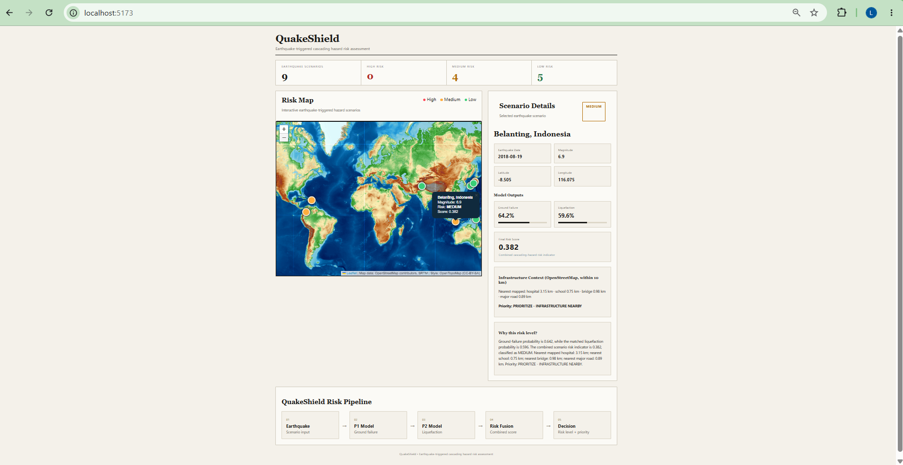

# QuakeShield

### Earthquake-triggered cascading hazard risk assessment

QuakeShield is a hackathon prototype for **scenario-level cascading-hazard risk assessment**. It combines predicted ground-failure probability, liquefaction probability, and nearby OpenStreetMap-mapped infrastructure to produce an interpretable risk score, risk level, and response-priority flag.

The system is designed to answer:

> **Given an earthquake scenario, what combination of cascading-hazard signals and nearby mapped infrastructure should be examined first?**

> **Prototype note:** QuakeShield is a research/demo system. It does not predict actual earthquake damage or provide operational emergency instructions.

---

## 📊 Interactive Dashboard



The dashboard presents:

* Earthquake magnitude and location
* Ground-failure probability
* Liquefaction probability
* Combined scenario-level risk score
* Risk level
* Nearby mapped infrastructure
* Approximate infrastructure distance
* Prototype response-priority flag
* Human-readable assessment explanation

---

## 🧭 How QuakeShield Works

```text
Earthquake scenario
        │
        ▼
P1 Model
Ground-failure probability
        │
        ▼
P2 Model
Liquefaction probability
        │
        ▼
Risk Fusion
Combined scenario-level risk score
        │
        ▼
Risk Level
LOW / MEDIUM / HIGH
        │
        ▼
Infrastructure Context
OpenStreetMap features within 10 km
        │
        ▼
Priority Rule + Explanation
```

### 01 — Earthquake Scenario

Each scenario contains an earthquake location and magnitude.

### 02 — P1: Ground-Failure Model

The P1 model estimates the probability of earthquake-triggered ground failure for the scenario location.

**Final P1 pipeline:**

```text
SimpleImputer
      ↓
StandardScaler
      ↓
LogisticRegression
```

### 03 — P2: Liquefaction Model

The P2 model estimates liquefaction probability across mapped sites and provides scenario-level liquefaction statistics.

**Final P2 pipeline:**

```text
SimpleImputer
      ↓
GradientBoostingClassifier
```

### 04 — Risk Fusion

The P1 and P2 outputs are combined by the project risk-fusion layer to produce a scenario-level risk score and:

* LOW
* MEDIUM
* HIGH

### 05 — Infrastructure Context

The system checks for nearby OpenStreetMap-mapped infrastructure within a 10 km search radius, including:

* Hospitals
* Schools
* Bridges
* Major roads

The infrastructure layer is used as **context and proximity information**, not as a validated structural-exposure model.

### 06 — Priority + Explanation

A prototype decision rule combines the risk level with mapped infrastructure context to generate a response-priority flag and a human-readable explanation.

---

## 📈 Results

The current pipeline produces **9 earthquake scenarios**.

| Scenario                   | Magnitude | Risk Score | Risk Level | Priority                           |
| -------------------------- | --------: | ---------: | ---------- | ---------------------------------- |
| Mesetas, Colombia          |       5.7 |      0.424 | MEDIUM     | PRIORITIZE - INFRASTRUCTURE NEARBY |
| Belanting, Indonesia       |       6.9 |      0.382 | MEDIUM     | PRIORITIZE - INFRASTRUCTURE NEARBY |
| Tohoku-Oki, Japan          |       9.1 |      0.380 | MEDIUM     | PRIORITIZE - INFRASTRUCTURE NEARBY |
| Maria Antonia, Puerto Rico |       6.4 |      0.380 | MEDIUM     | MONITOR / FURTHER ASSESSMENT       |
| Niigata-Chuetsu, Japan     |       6.6 |      0.297 | LOW        | LOWER PRIORITY                     |
| Kashmir, Pakistan          |       7.6 |      0.285 | LOW        | LOWER PRIORITY                     |
| Kobe, Japan                |       6.9 |      0.271 | LOW        | LOWER PRIORITY                     |
| Palu, Indonesia            |       7.5 |      0.216 | LOW        | LOWER PRIORITY                     |
| Tari, Papua New Guinea     |       7.5 |      0.210 | LOW        | LOWER PRIORITY                     |

### Example: Belanting, Indonesia

| Indicator                     |                              Value |
| ----------------------------- | ---------------------------------: |
| Magnitude                     |                                6.9 |
| Ground-failure probability    |                              64.2% |
| Mean liquefaction probability |                              59.6% |
| Final risk score              |                              0.382 |
| Risk level                    |                             MEDIUM |
| Nearest mapped hospital       |                            3.15 km |
| Nearest mapped school         |                            0.75 km |
| Nearest mapped bridge         |                            0.98 km |
| Nearest mapped road           |                            0.89 km |
| Prototype priority            | PRIORITIZE - INFRASTRUCTURE NEARBY |

These values demonstrate how the system combines hazard probabilities with infrastructure context for an interpretable scenario assessment.

---

## 🗂️ Data & Outputs

The pipeline generates scenario-level outputs including:

* Ground-failure probability
* Liquefaction probability statistics
* Combined risk score
* Risk level
* Infrastructure presence
* Nearest mapped infrastructure distances
* Priority level
* Human-readable explanation

Main generated files:

```text
outputs/
├── quakeshield_final_output.csv
├── quakeshield_map_data.csv
├── quakeshield_explanations.csv
└── risk_fusion_inputs.csv
```

The main final output is:

```text
outputs/quakeshield_final_output.csv
```

---

## 📁 Repository Structure

```text
TrustLens/
│
├── data/
│   └── raw/                         # Source datasets
│
├── models/                          # Trained P1 and P2 models
│
├── outputs/                         # Generated pipeline outputs
│   ├── quakeshield_final_output.csv
│   ├── quakeshield_map_data.csv
│   ├── quakeshield_explanations.csv
│   └── risk_fusion_inputs.csv
│
├── scripts/
│   ├── p1/                          # Ground-failure model
│   ├── p2/                          # Liquefaction model
│   └── risk/                        # Risk fusion + infrastructure layer
│
├── frontend/
│   ├── public/
│   │   └── quakeshield-dashboard.png
│   └── src/                         # React dashboard
│
├── quakeshield_pipeline.py          # Main end-to-end pipeline
├── requirements.txt
└── README.md
```

---

## 🚀 Running the Backend

Install the Python dependencies:

```bash
pip install -r requirements.txt
```

Run the complete pipeline:

```bash
python quakeshield_pipeline.py
```

The pipeline processes the hazard models, performs risk fusion, adds infrastructure context, and writes the generated CSV outputs.

---

## 🖥️ Running the Dashboard

The dashboard uses **React + Vite + Leaflet**.

From the repository root:

```bash
cd frontend
npm install
npm run dev
```

Then open:

```text
http://localhost:5173
```

### Refreshing Frontend Scenario Data

After generating a new:

```text
outputs/quakeshield_final_output.csv
```

regenerate the frontend scenario data with:

```bash
cd frontend
python make_frontend_data.py ../outputs/quakeshield_final_output.csv
```

Then restart the Vite development server if necessary.

---

## 🗺️ Refreshing OpenStreetMap Infrastructure

The infrastructure layer can be refreshed using:

```bash
python scripts/risk/get_infrastructure.py
python scripts/risk/calculate_infrastructure_risk.py
```

This requires internet access and the required geospatial/OSM Python packages.

The infrastructure layer currently considers nearby mapped:

* Hospitals
* Schools
* Bridges
* Major roads

---

## ⚠️ Limitations

QuakeShield is intentionally presented as a prototype rather than an operational prediction system.

### Proximity is not exposure

Infrastructure distances are measured from the scenario point/search location. A nearby feature does not necessarily mean that the infrastructure is inside the actual hazard footprint or would be damaged.

### OpenStreetMap coverage is incomplete

`none mapped` means that no matching OpenStreetMap feature was returned within the configured search radius. It does **not** mean that the real-world infrastructure does not exist.

### No structural damage prediction

The current system does not model:

* Building vulnerability
* Structural damage
* Population exposure
* Infrastructure fragility
* Actual economic losses
* Evacuation requirements

### Priority is a prototype rule

The response-priority flag is a simple decision-support rule based on the current risk level and mapped infrastructure context. It is **not a validated emergency-response model**.

### Limited scenario set

The current demonstration contains 9 scenarios. These results should not be interpreted as historical validation or evidence of real-world predictive performance.

---

## 🔭 Future Work

Potential extensions include:

* Overlaying infrastructure against predicted hazard footprints instead of a point-radius search
* Adding population and building exposure
* Incorporating infrastructure vulnerability and fragility
* Replacing the presence-based priority rule with a distance- and exposure-aware scoring system
* Mapping ground-failure and liquefaction probabilities spatially
* Adding uncertainty estimates
* Validating predictions against historical earthquake impact datasets
* Expanding the scenario library

---

## 🎯 Project Goal

QuakeShield demonstrates how multiple hazard signals can be combined with infrastructure context to create an **interpretable scenario-level cascading-hazard assessment**.

The goal is not to claim exact earthquake damage prediction, but to demonstrate a reproducible workflow that connects:

```text
Hazard Models
      +
Risk Fusion
      +
Infrastructure Context
      ↓
Interpretable Scenario Assessment
```

---

## ⚖️ Disclaimer

**Research/hackathon prototype for demonstration purposes.**

QuakeShield is not an operational emergency-response system and should not be used to make real-world emergency decisions.
